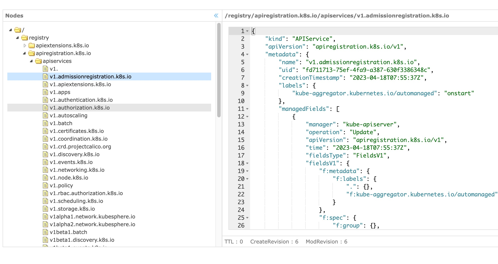

k8s的etcd数据查看工具,参考自[https://github.com/evildecay/etcdkeeper](https://github.com/evildecay/etcdkeeper)  
增加了k8s protobuf格式数据解析 

配置config.yaml后 go run main.go运行
```bash
curl http://0.0.0.0:8080/ui/
```
已知问题:为了简化数据量,只返回了三级的数据,直接点击三角形展开会有问题,建议直接点击文件夹

